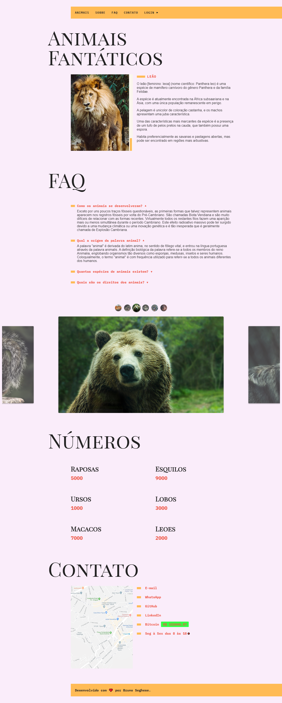

# JavaScript ES6+ 

## 🐺 Origamid - Curso Completo de JavaScript

### 📚 Material de Apoio

- [JavaScript ES6+ Completo](https://www.origamid.com/slide/javascript-completo-es6/#/0101-javascript-completo-es6/1) 🔗

---

### 🚀 ​ [Clique aqui](https://od-animais-fantasticos.netlify.app/)🔗 para acessar o projeto final do curso.

---

### ✨ Tópicos e Exercícios

####

1. JavaScript para Iniciantes

####

- Variáveis
- Tipos de Dados
- Números e Operadores
- Boolean e Condicionais
- Funções
- Objetos
- Arrays e Loops
- Atribuições e Ternários
- Escopo

2. Dom para Iniciantes

####

- O que é DOM?
- Seleção de Elementos
- forEach e Arrow Function
- Classes e Atributos
- Dimensões e Distancias
- Eventos
- Traversing e Manipulação
- Navegação por Tab
- Accordion List
- Scroll suave link interno
- Animação ao scroll

3. Objetos

####

- Constructor Functions
- Prototype
- Native, Host e User1
- String
- Number
- Array
- Array e Iteração
- Function
- Object

4. Efeitos no DOM

####

- Dataset
- Modal
- Tool Tip
- Dropdown Menu
- setTimeout & setInterval
- Menu Mobile
- Anima Números
- Date Object
- Forms
- Button Creator

5. JavaScript Assíncrono

####

- Promises
- Fetch API
- Json
- API e HTTP
- Async Await
- History API
- Fetch Numeros
- Fetch Bitcoin

6. Classes

####

- Classes
- Get e Set
- Extends
- Countdown

7. Mais JavaScript

####

- Function Expression
- Factory Function
- Clojures e Debugging
- Destructuring
- Rest e Spread
- Loops e Interable

8. Regular Expression

####

- Regexp
- Limpar CPF
- Validar CPF

9. Automação Front-end

####

- Webpack
- Babel
- Git

10. Refatoração

####

- Scroll Suave
- Accordion
- Modal
- Tooltip
- Anima Números
- Fetch Animais
- Fetch Bitcoin
- Animação Scroll
- Dropdown Menu
- Menu Mobile
- Funcionamento

---

### 🎥 Preview

---

### 📝 License

Esse projeto é licenciado pela MIT License. [Clique aqui](https://pt.wikipedia.org/wiki/Licen%C3%A7a_MIT)🔗 para mais detalhes.

---

### ✒️ Autor

[Clique aqui](https://brseghese.github.io)🔗 e acesse meu portfólio! 💼 (em construção...)

---

#### 💬 Sinta-se a vontade para entrar em contato

  

---

> Desenvolvido com ❤️ por **Bruno Seghese**

---
